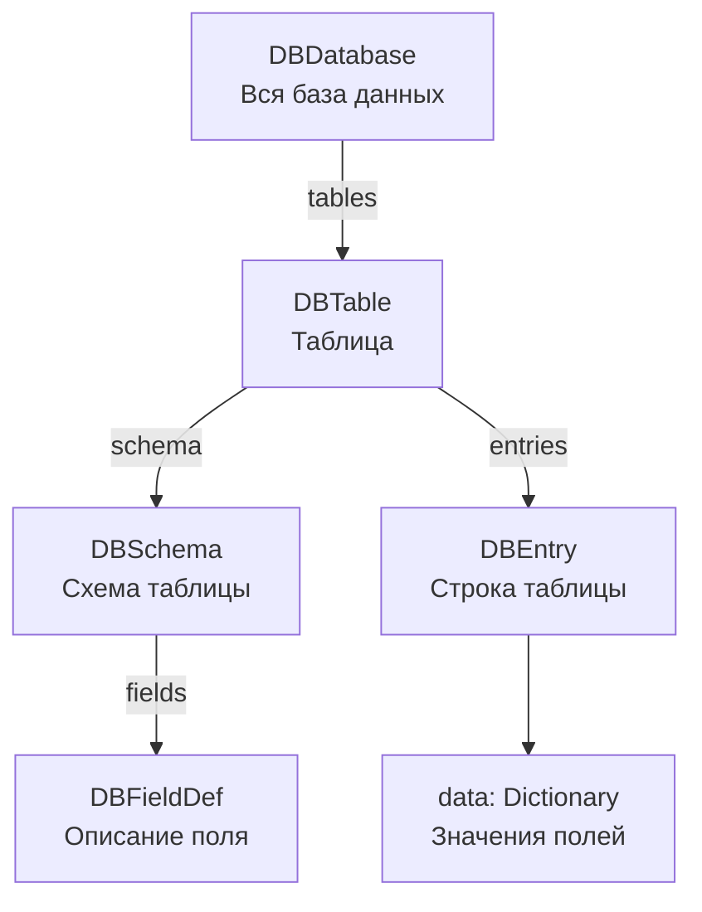

# GD Database

**GD Database** — это плагин для Godot, который добавляет в редактор удобную табличную “базу данных” на основе `Resource`-файлов Godot (`.tres` / `.res`).

Плагин позволяет создавать таблицы, описывать схемы полей, редактировать строки прямо в редакторе, импортировать/экспортировать данные, генерировать GDScript `enum`-ы и получать данные в игре через runtime API.

---

## Возможности

- Создание базы данных как Godot-ресурса `DBDatabase`.
- Несколько таблиц внутри одной базы.
- Схемы таблиц с типизированными полями.
- Табличный редактор строк в нижней панели Godot.
- Поддержка типов:
  - `int`
  - `float`
  - `string`
  - `bool`
  - `enum`
  - `Vector2`
  - `Vector3`
  - `Color`
  - `Resource Ref`
  - `Array`
  - `Nested Object`
  - `Dictionary`
- Вложенные объекты с отдельными схемами.
- Типизированные массивы и словари.
- Переиспользуемые `enum`-источники.
- Импорт / экспорт JSON.
- Экспорт CSV для таблиц.
- Генерация `.gd` файла с настоящими `enum`.
- Runtime API для чтения базы из игры.

---

## Структура данных



Основные классы:

| Класс | Назначение |
|---|---|
| `DBDatabase` | Главный ресурс базы данных. Хранит таблицы. |
| `DBTable` | Таблица. Хранит схему и строки. |
| `DBSchema` | Описание структуры таблицы. |
| `DBFieldDef` | Описание одного поля: имя, тип, enum, default value и т.д. |
| `DBEntry` | Одна строка таблицы. |
| `DBAccess` | Runtime API для чтения данных из игры. |
| `DBEnumExporter` | Генератор GDScript enum-файлов. |

---

# Установка

## 1. Подключить плагин

Скопируй папку плагина в проект, например:

```text
res://addons/gd_database/
```

Внутри должны быть файлы примерно такой структуры:

```text
addons/gd_database/
├── plugin.gd
├── core/
├── editor/
└── runtime/
```

После этого включи плагин:

```text
Project → Project Settings → Plugins → GD Database → Enable
```

После включения внизу редактора появится вкладка:

```text
GD Database
```

---

## 2. Подключить runtime API как Autoload

Рекомендуемый способ использования базы в игре — через singleton `DB`.

Открой:

```text
Project → Project Settings → Autoload
```

Добавь файл:

```text
res://addons/gd_database/runtime/db_access.gd
```

Имя singleton-а:

```text
DB
```

После этого в коде можно будет писать:

```gdscript
DB.load_database("res://data/my_database.tres")

var hero := DB.get_row("Heroes", "heroes_0001")

for item in DB.get_rows("Items"):
    print(item)
```

---

# Быстрый старт

## 1. Создать новую базу

Открой нижнюю панель:

```text
GD Database
```

Нажми:

```text
New DB
```

Укажи имя базы и путь сохранения, например:

```text
res://data/my_database.tres
```

После создания база будет сохранена как обычный Godot Resource.

---

## 2. Создать таблицу

В левой панели `Tables` нажми кнопку:

```text
+
```

Откроется редактор схемы.

Укажи:

- `Schema Name` — имя схемы.
- `Table Name` — имя таблицы.
- `Description` — описание, необязательно.

Например:

```text
Schema Name: Item
Table Name: Items
Description: Game items database
```

---

## 3. Добавить поля

В редакторе схемы нажми:

```text
+ Add Field
```

Пример полей для таблицы `Items`:

| Field Name | Type | Description |
|---|---|---|
| `name` | `string` | Название предмета |
| `price` | `int` | Цена |
| `weight` | `float` | Вес |
| `is_unique` | `bool` | Уникальный предмет |
| `rarity` | `enum` | Редкость |
| `icon` | `Resource Ref` | Путь к иконке |

Для `enum` можно указать значения через запятую:

```text
Common,Rare,Epic,Legendary
```

---

## 4. Добавить строки

Выбери таблицу в левой панели.

В правой части появится табличный редактор.

Нажми:

```text
+ Row
```

Новая строка получит автоматический ID, например:

```text
items_0001
```

Дальше значения можно редактировать прямо в таблице.

---

## 5. Сохранить базу

Нажми:

```text
💾 Save
```

Или при закрытии/сохранении проекта плагин также может применить изменения через `_apply_changes()`.

---

# Использование в игре

## Через Autoload `DB`

```gdscript
func _ready() -> void:
    DB.load_database("res://data/my_database.tres")

    var item := DB.get_row("Items", "items_0001")
    print(item["name"])
    print(item["price"])
```

Пример результата:

```gdscript
{
    "_id": "items_0001",
    "_schema": "Item",
    "name": "Iron Sword",
    "price": 100,
    "weight": 2.5,
    "is_unique": false,
    "rarity": 1,
    "icon": "res://icons/iron_sword.png"
}
```

---

## Без Autoload

Можно создать отдельный экземпляр `DBAccess`:

```gdscript
var db := DBAccess.open("res://data/my_database.tres")

if db.is_loaded():
    var rows := db.get_rows("Items")
    for row in rows:
        print(row["name"])
```

---

# Runtime API

## Загрузка базы

```gdscript
DB.load_database("res://data/my_database.tres")
```

Также можно передать уже загруженный ресурс:

```gdscript
var resource: DBDatabase = preload("res://data/my_database.tres")
DB.load_database(resource)
```

Проверка:

```gdscript
if DB.is_loaded():
    print(DB.get_database_name())
```

Перезагрузка с диска:

```gdscript
DB.reload()
```

---

## Получение строк

### Получить одну строку по ID

```gdscript
var hero := DB.get_row("Heroes", "heroes_0001")
```

Если строка не найдена, вернётся пустой `Dictionary`.

---

### Получить строку по индексу

```gdscript
var first_item := DB.get_row_at("Items", 0)
```

---

### Получить все строки таблицы

```gdscript
var items := DB.get_rows("Items")

for item in items:
    print(item["name"])
```

---

### Получить строки как словарь по ID

```gdscript
var items_by_id := DB.get_rows_by_id("Items")

var sword := items_by_id["items_0001"]
print(sword["name"])
```

---

## Получение значений

### Одно значение

```gdscript
var price := DB.get_value("Items", "items_0001", "price", 0)
```

Аргументы:

```gdscript
get_value(table_name, entry_id, field_name, default)
```

---

### Вся колонка

```gdscript
var prices := DB.get_column("Items", "price")

for price in prices:
    print(price)
```

---

## Поиск и фильтрация

### Найти строки по точному совпадению

```gdscript
var rare_items := DB.find_rows("Items", "rarity", 1)
```

---

### Найти первую строку

```gdscript
var sword := DB.find_first("Items", "name", "Iron Sword")
```

---

### Произвольный фильтр

```gdscript
var expensive_items := DB.where("Items", func(row):
    return row["price"] > 1000
)
```

---

### Текстовый поиск

```gdscript
var result := DB.search("Items", "sword")
```

Поиск идёт по всем значениям строки через строковое представление.

---

### Сортировка

```gdscript
var sorted_items := DB.get_rows_sorted("Items", "price", true)
```

По убыванию:

```gdscript
var sorted_items := DB.get_rows_sorted("Items", "price", false)
```

Сортировка по ID:

```gdscript
var rows := DB.get_rows_sorted("Items", "_id")
```

---

# Интроспекция базы

## Все таблицы

```gdscript
var tables := DB.get_table_names()
```

---

## Проверить наличие таблицы

```gdscript
if DB.has_table("Items"):
    print("Items table exists")
```

---

## Получить схемы

```gdscript
var schemas := DB.get_schema_names()
```

---

## Получить поля таблицы

```gdscript
var fields := DB.get_field_names("Items")
```

---

## Проверить наличие поля

```gdscript
if DB.has_field("Items", "price"):
    print("Items.price exists")
```

---

## Описание таблицы

```gdscript
var desc := DB.describe_table("Items")
print(desc)
```

Пример:

```gdscript
{
    "name": "string",
    "price": "int",
    "rarity": "enum[Common,Rare,Epic,Legendary]",
    "icon": "Resource<Texture2D>"
}
```

---

# Типы полей

## `int`

Целое число.

```gdscript
var hp: int = row["hp"]
```

---

## `float`

Число с плавающей точкой.

```gdscript
var speed: float = row["speed"]
```

---

## `string`

Строка.

```gdscript
var name: String = row["name"]
```

---

## `bool`

Логическое значение.

```gdscript
var unlocked: bool = row["unlocked"]
```

---

## `enum`

`enum` хранится как `int` — индекс выбранного значения.

Например, если значения:

```text
Fire,Ice,Thunder
```

То:

| Значение | Индекс |
|---|---:|
| `Fire` | `0` |
| `Ice` | `1` |
| `Thunder` | `2` |

Использование:

```gdscript
var element: int = row["element"]

if element == 0:
    print("Fire")
```

Можно получить подпись:

```gdscript
var label := DB.enum_label("Spells", "element", row["element"])
print(label)
```

Или индекс по подписи:

```gdscript
var fire_index := DB.enum_index("Spells", "element", "Fire")
```

---

## `Vector2`

Хранится и возвращается как `Vector2`.

```gdscript
var pos: Vector2 = row["position"]
```

---

## `Vector3`

Хранится и возвращается как `Vector3`.

```gdscript
var spawn: Vector3 = row["spawn_position"]
```

---

## `Color`

Хранится и возвращается как `Color`.

```gdscript
var color: Color = row["ui_color"]
```

---

## `Resource Ref`

Это строковый путь к ресурсу.

```gdscript
var icon_path: String = row["icon"]
var icon := load(icon_path)
```

Пример значения:

```text
res://assets/icons/sword.png
```

---

## `Array`

Типизированный массив.

В схеме можно выбрать тип элемента:

```text
Array<int>
Array<string>
Array<enum>
Array<Nested Object>
Array<Dictionary>
```

Пример:

```gdscript
var tags: Array = row["tags"]
```

---

## `Nested Object`

Вложенный объект хранится как `Dictionary`.

Можно использовать:

- свободный объект без схемы;
- объект по схеме другой таблицы.

Пример:

```gdscript
var stats: Dictionary = row["stats"]

print(stats["strength"])
print(stats["dexterity"])
```

---

## `Dictionary`

Типизированный словарь ключ → значение.

В схеме можно указать:

- тип ключа;
- тип значения;
- enum-значения для ключа;
- enum-значения для значения.

Пример:

```gdscript
var resistances: Dictionary = row["resistances"]

print(resistances["fire"])
print(resistances["ice"])
```

---

# Enum-ссылки

Плагин поддерживает переиспользуемые `enum`.

Например, в одной схеме есть поле:

```text
Schema: CommonTypes
Field: element
Values: Fire,Ice,Thunder
```

Такое поле становится источником:

```text
CommonTypes/element
```

В другом поле можно выбрать режим:

```text
Reference existing enum
```

И сослаться на:

```text
CommonTypes/element
```

Это удобно, если разные таблицы должны использовать одинаковый набор enum-значений.

Enum-ссылки поддерживаются для:

- обычного `ENUM`;
- `Array<ENUM>`;
- значения `Dictionary`, если `dict_value_type == ENUM`;
- ключа `Dictionary`, если `dict_key_type == ENUM`.

---

# Генерация GDScript enum

В верхней панели плагина есть кнопка:

```text
⚙ Gen Enums
```

Она генерирует `.gd` файл с настоящими GDScript `enum`.

Например, если есть поле:

```text
element = Fire, Ice, Thunder
```

Будет сгенерировано примерно:

```gdscript
@tool
class_name GameEnums

enum Element {
    FIRE = 0,
    ICE = 1,
    THUNDER = 2,
}

const ELEMENT_LABELS: PackedStringArray = ["Fire", "Ice", "Thunder"]

static func element_label(value: int) -> String:
    return ELEMENT_LABELS[value] if value >= 0 and value < ELEMENT_LABELS.size() else ""
```

Использование:

```gdscript
if spell["element"] == GameEnums.Element.FIRE:
    print("Fire spell")
```

Получение подписи:

```gdscript
var label := GameEnums.element_label(spell["element"])
```

---

## Enum имён колонок

Генератор также умеет создавать enum-ы с именами колонок таблиц.

Например, для таблицы `Items` с полями:

```text
name
price
rarity
icon
```

Может быть создан enum:

```gdscript
enum ItemsColumns {
    NAME = 0,
    PRICE = 1,
    RARITY = 2,
    ICON = 3,
}
```

Это удобно, если нужно безопасно ссылаться на колонки из кода или инструментов.

---

# Import / Export

Кнопка:

```text
Import / Export
```

открывает окно импорта и экспорта.

---

## JSON export

Можно экспортировать:

- всю базу;
- отдельную таблицу.

Полный JSON имеет структуру примерно:

```json
{
  "database_name": "MyDatabase",
  "version": "1.0.0",
  "tables": {
    "Items": {
      "schema": "Item",
      "entries": [
        {
          "_id": "items_0001",
          "_schema": "Item",
          "name": "Iron Sword",
          "price": 100
        }
      ]
    }
  }
}
```

---

## JSON import

JSON можно импортировать обратно через:

```text
◀ Import from Text
```

Поддерживаются форматы:

- полный export базы;
- export одной таблицы.

Важно: импорт обновляет существующие строки по `_id`, а новые строки добавляет в таблицу.

---

## CSV export

CSV экспорт доступен для выбранной таблицы.

Для CSV нужно выбрать конкретную таблицу, не `(All tables)`.

CSV удобно использовать для просмотра данных во внешних редакторах.

---

# Работа с таблицами в редакторе

В левой панели `Tables` доступны кнопки:

| Кнопка | Действие |
|---|---|
| `+` | Создать новую таблицу |
| `⚙` | Редактировать схему |
| `✎` | Переименовать таблицу |
| `−` | Удалить таблицу |

Двойной клик по таблице также открывает редактор схемы.

---

# Работа со строками

В табличном редакторе доступны:

| Кнопка | Действие |
|---|---|
| `+ Row` | Добавить строку |
| `− Row` | Удалить выбранную строку |
| `⎘ Dup` | Дублировать выбранную строку |

Также есть:

- фильтр по полю;
- поиск по всем полям;
- сортировка по клику на заголовок колонки;
- переход к колонке через `Go to column`.

---

# Редактирование сложных типов

Для сложных типов используются отдельные окна:

| Тип | Редактор |
|---|---|
| `Vector2` | Окно редактирования X/Y |
| `Vector3` | Окно редактирования X/Y/Z |
| `Color` | ColorPicker |
| `Resource Ref` | FileDialog |
| `Array` | ArrayEditorDialog |
| `Dictionary` | DictionaryEditorDialog |
| `Nested Object` | NestedObjectEditor |

---

# Пример базы предметов

## Таблица `Items`

Схема `Item`:

| Поле | Тип |
|---|---|
| `name` | `string` |
| `price` | `int` |
| `rarity` | `enum` |
| `icon` | `Resource Ref` |
| `tags` | `Array<string>` |
| `stats` | `Dictionary<string, int>` |

Enum `rarity`:

```text
Common,Rare,Epic,Legendary
```

Использование в игре:

```gdscript
func _ready() -> void:
    DB.load_database("res://data/items_database.tres")

    var item := DB.get_row("Items", "items_0001")

    print(item["name"])
    print(item["price"])

    var rarity_label := DB.enum_label("Items", "rarity", item["rarity"])
    print("Rarity: ", rarity_label)

    var tags: Array = item["tags"]
    var stats: Dictionary = item["stats"]

    print(tags)
    print(stats)
```

---

# Программное создание базы

Базу можно создавать не только через редактор, но и из кода.

```gdscript
var db := DBDatabase.new()
db.database_name = "GameDatabase"

var schema := DBSchema.new()
schema.schema_name = "Item"

var name_field := DBFieldDef.new()
name_field.field_name = "name"
name_field.field_type = DBFieldDef.FieldType.STRING
schema.add_field(name_field)

var price_field := DBFieldDef.new()
price_field.field_name = "price"
price_field.field_type = DBFieldDef.FieldType.INT
schema.add_field(price_field)

var table := db.create_table("Items", schema)

var entry := table.add_entry()
entry.set_value("name", "Iron Sword")
entry.set_value("price", 100)

ResourceSaver.save(db, "res://data/game_database.tres")
```

---

# Рекомендации

## Храни базы в отдельной папке

Например:

```text
res://data/
res://database/
res://resources/database/
```

---

## Используй стабильные имена таблиц

ID строк генерируется на основе имени таблицы:

```text
items_0001
items_0002
items_0003
```

Если переименовать таблицу, старые ID строк не меняются автоматически.

---

## Для enum лучше использовать генерацию

Вместо магических чисел:

```gdscript
if item["rarity"] == 3:
    ...
```

лучше использовать сгенерированный enum:

```gdscript
if item["rarity"] == GameEnums.Rarity.LEGENDARY:
    ...
```

---

## Для вложенных объектов используй отдельные схемы

Если структура вложенного объекта повторяется, лучше создать отдельную таблицу/схему и указать её имя в поле `Nested Object`.

Например:

```text
Schema: Stats
Fields:
- strength: int
- dexterity: int
- intelligence: int
```

А в таблице `Items` поле:

```text
stats: Nested Object
Nested Schema Name: Stats
```

---

# Краткий пример использования

```gdscript
func _ready() -> void:
    DB.load_database("res://data/game_database.tres")

    var heroes := DB.get_rows("Heroes")

    for hero in heroes:
        print(hero["_id"])
        print(hero["name"])
        print(hero["hp"])

    var strong_heroes := DB.where("Heroes", func(row):
        return row["hp"] > 100
    )

    for hero in strong_heroes:
        print("Strong hero: ", hero["name"])
```

---

# Что в итоге делает плагин

GD Database превращает Godot Resource-файлы в удобную табличную базу данных внутри редактора.

Он полезен для хранения:

- предметов;
- персонажей;
- врагов;
- способностей;
- уровней;
- диалогов;
- конфигов;
- баланса;
- справочников enum-значений;
- любых игровых данных, которые удобно редактировать в таблицах.

В редакторе ты создаёшь и редактируешь данные визуально, а в игре читаешь их через простой API:

```gdscript
DB.load_database("res://data/my_database.tres")
var row := DB.get_row("Items", "items_0001")
```